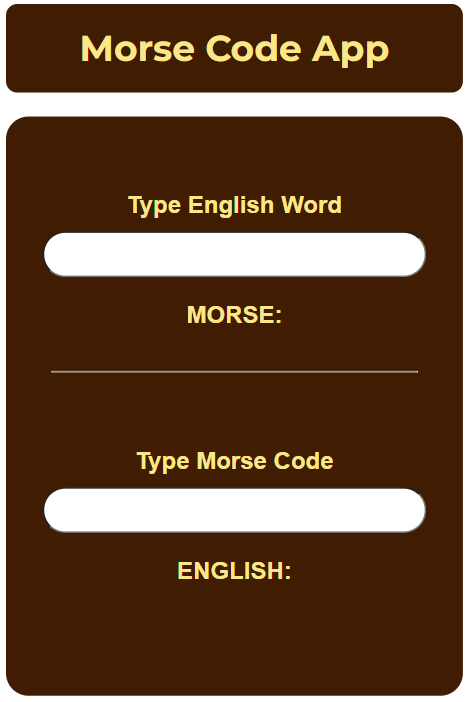
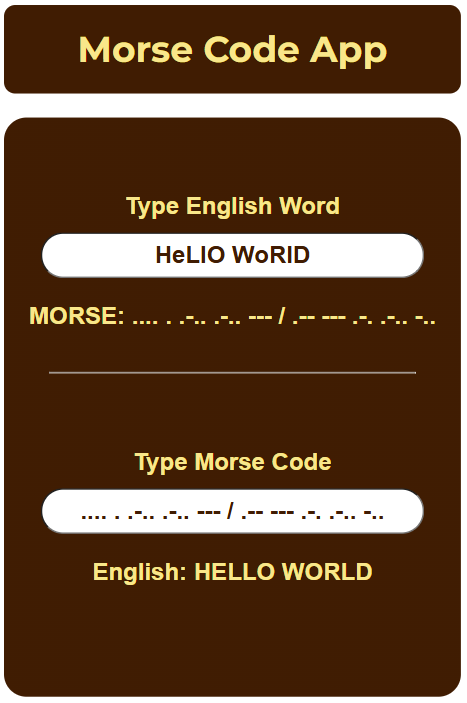
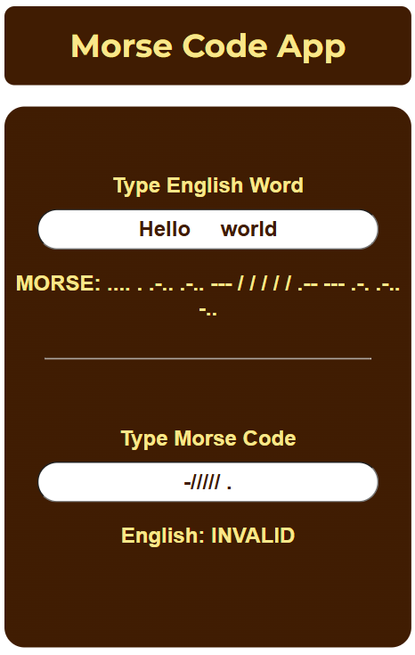

# Morse Code Project

Browser project built with Javascript, HTML and SASS.

<!-- [LIVE DEMO](https://pikmot.github.io/morse-code/) -->

## Preview

### HOME PAGE | VALID INPUT | INVALID INPUT

## MVP

- [x] Create a User interface to input English
- [x] Create a User interface to input Morse Code
- [x] Accepts strictly letters for English
- [x] Accepts strictly four characters [ "\*" , "/" , "-" , " " ] for Morse Code.
- [x] Upon entering or clicking away from input field, English or Morse will Translate and dispaly below field
- [x] Testing to handle errors on all non DOM fucntions using JEST

## Techstack

- HTML5
- CSS/SASS
- JAVASCRIPT (ES6+)
- Vitest/Jest

## Design Decisions

- Extra spaces are truncated to single spacing e.g. "1234" -> "1" for Morse - English
- Edge cases for Morse code incldue "./" | "/." | "-/" | "/-" return invalid for Morse - English
- Edge case of spaces between English words are translated as normal with " / " as if it were an empty word.

# Takeaway

- Testing proved crucial, as several edge cases in the Morse code conversion returned undefined values. After testing and simulating a range of edge cases, these issues were identified and handled appropriately.
- Separating the functions under test into their own files and importing them also made the testing process more straightforward.
